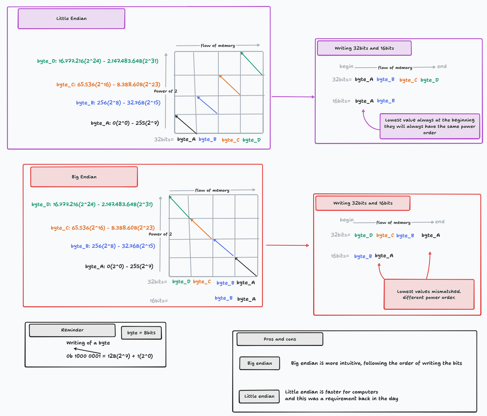

# ft_ssl

> Usage : ./ft_ssl **command** [-pqr] [-s`<string>`] [file]

Supported commands include **md5** and **sha256**.

## Documentation

### MD5

The [md5 algorithm wikipedia page](https://en.wikipedia.org/wiki/MD5).

[Collision wikipedia page](https://en.wikipedia.org/wiki/Hash_collision).\
[Collision example](https://crypto.stackexchange.com/questions/1434/are-there-two-known-strings-which-have-the-same-md5-hash-value).

An okay-ish step by step explanation of the [md5 algorithm](https://www.comparitech.com/blog/information-security/md5-algorithm-with-examples/).\
**WARNING :** most of the values used in this example are wrong, favor using the [official md5 documentation rfc](https://www.ietf.org/rfc/rfc1321.txt) for those.

And a good [md5 block visualization](https://fthb321.github.io/MD5-Hash/MD5OurVersion2.html).

#### [Figure 1]
A visual representation of the core MD5 loop. [Source](https://cdn.comparitech.com/wp-content/uploads/2021/06/md5-no-2fix-02-scaled.jpg)\

#### [Figure 2]
A visual representation of the individual operation inside the core MD5 loop. [source](https://cdn.comparitech.com/wp-content/uploads/2021/06/md5-011-scaled.jpg)\

### Endianness

#### [Figure 3]
In case you need a reminder about how [endianness](https://en.wikipedia.org/wiki/Endianness) works here is a visual explanation of how it works :

